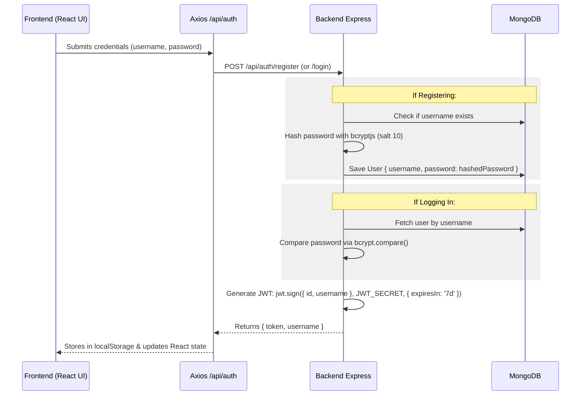
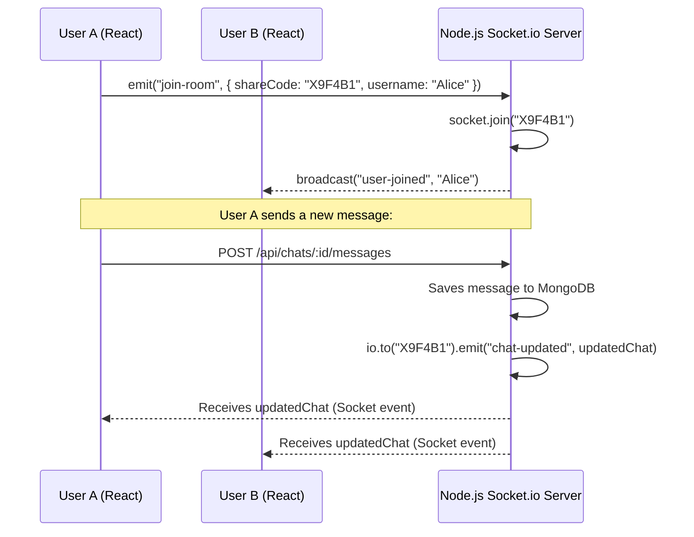

# Full Project Architecture & Execution Flow: ChatGPT Clone

This document explains exactly how this collaborative ChatGPT clone is structured and operates under the hood. It serves as a comprehensive study guide to prepare for technical interviews.

---

## 1. Directory Structure Overview
The application is separated into a frontend (React single-page application built with Vite) and a backend (Node.js/Express REST API and Socket.io server).

* **Backend (`/backend`)**:
  * [server.js](file:///c:/webdevelopment/chatgpt/backend/server.js) — Entry point. Sets up Express, HTTP server, Socket.io, MongoDB connection, routes, and socket handlers.
  * [models/User.js](file:///c:/webdevelopment/chatgpt/backend/models/User.js) — MongoDB schema for user records.
  * [models/Chat.js](file:///c:/webdevelopment/chatgpt/backend/models/Chat.js) — MongoDB schema for collaborative chats and embedded message lists.
  * [routes/authRoutes.js](file:///c:/webdevelopment/chatgpt/backend/routes/authRoutes.js) — Directs `/api/auth` traffic to the auth controller.
  * [routes/chatRoutes.js](file:///c:/webdevelopment/chatgpt/backend/routes/chatRoutes.js) — Directs `/api/chats` traffic to the chat controller, protected by auth middleware.
  * [middleware/authMiddleware.js](file:///c:/webdevelopment/chatgpt/backend/middleware/authMiddleware.js) — Verifies JWT tokens on protected HTTP requests.
  * [controllers/authController.js](file:///c:/webdevelopment/chatgpt/backend/controllers/authController.js) — Handles registration, password hashing, and login validation.
  * [controllers/chatController.js](file:///c:/webdevelopment/chatgpt/backend/controllers/chatController.js) — Manages chat creation, room sharing, joining, messaging, and AI LLM integrations.

* **Frontend (`/frontend`)**:
  * [src/App.jsx](file:///c:/webdevelopment/chatgpt/frontend/src/App.jsx) — Core component holding state (chats, messages, active room, auth token).
  * [src/components/Auth.jsx](file:///c:/webdevelopment/chatgpt/frontend/src/components/Auth.jsx) — Controls login and registration UI state and API requests.
  * [src/services/api.js](file:///c:/webdevelopment/chatgpt/frontend/src/services/api.js) — Standard Axios client with an interceptor to auto-inject the JWT token.
  * [src/services/socket.js](file:///c:/webdevelopment/chatgpt/frontend/src/services/socket.js) — Instantiates the Socket.io client connection to the backend.

---

## 2. Authentication Flow (Register / Login)



### Hashing Passwords Securely
Plain-text passwords must never be stored. The app uses `bcryptjs`:
* **Salt rounds = 10**: Strikes a balance between high security and hashing speed.
* Code location: [authController.js](file:///c:/webdevelopment/chatgpt/backend/controllers/authController.js#L19).

### JWT (JSON Web Token) Generation
Upon successful registration or login, the backend generates a signed JWT token containing the user's details:
```javascript
const token = jwt.sign(
  { id: user._id, username: user.username },
  JWT_SECRET,
  { expiresIn: '7d' }
);
```
* **Payload**: Encodes user ID and username.
* **Signature**: Sealed using a server-side secret key `JWT_SECRET` stored in env variables, ensuring it cannot be tampered with.

---

## 3. Frontend-Backend HTTP Security & Middleware

Once authenticated, every subsequent request from the frontend must prove the user's identity.

### Axios Request Interceptor
In [api.js](file:///c:/webdevelopment/chatgpt/frontend/src/services/api.js#L8-L19), an Axios request interceptor automatically intercepts outgoing HTTP requests and injects the JWT token from local storage into the `Authorization` header as a Bearer token:
```javascript
axios.interceptors.request.use(
  (config) => {
    const token = localStorage.getItem('token');
    if (token) {
      config.headers['Authorization'] = `Bearer ${token}`;
    }
    return config;
  }
);
```

### Backend Auth Middleware
Protected backend endpoints pass through [authMiddleware.js](file:///c:/webdevelopment/chatgpt/backend/middleware/authMiddleware.js) before hitting controllers:
1. Grabs `req.header('Authorization')`.
2. Extracts the token (removes `Bearer ` prefix).
3. Verifies it using `jwt.verify(token, JWT_SECRET)`.
4. Attaches the decoded payload (containing user `id` and `username`) to the request object: `req.user = decoded`.
5. Calls `next()` to hand off control to the next handler. If verification fails, it sends a `401 Unauthorized` response.

---

## 4. Mongoose Database Schema & Collaborative Chat Architecture

The application stores data in MongoDB using two main collections: **Users** and **Chats**.

### Users Collection Schema
Defined in [User.js](file:///c:/webdevelopment/chatgpt/backend/models/User.js):
* `username`: Trimmed, lowercased, and marked `unique: true`.
* `password`: Hashed password string.

### Collaborative Chats Collection Schema
Defined in [Chat.js](file:///c:/webdevelopment/chatgpt/backend/models/Chat.js):
* `title`: Auto-updated using the first 30 characters of the initial message.
* `shareCode`: A unique 6-character uppercase alphanumeric code (e.g., `B9F4E1`) generated using:
  ```javascript
  crypto.randomBytes(3).toString('hex').toUpperCase();
  ```
* `creator`: Reference to the `User` object who created the room.
* `participants`: An array of references to `User` objects who are members of this room.
* `messages`: A sub-document list of messages containing:
  * `role`: `'user'` (user input) or `'model'` (AI output).
  * `content`: The text message content.

### Sharing / Join Collaborative Room Workflow
1. User A creates a chat. A unique `shareCode` is assigned to it.
2. User A shares the `shareCode` with User B.
3. User B inputs the code in the frontend. This hits:
   * **POST** `/api/chats/join` (handled by [joinChatByCode](file:///c:/webdevelopment/chatgpt/backend/controllers/chatController.js#L43)).
4. The backend checks if the room exists and inserts User B's user ID into the `participants` array in MongoDB:
   ```javascript
   if (!chat.participants.includes(req.user.id)) {
     chat.participants.push(req.user.id);
     await chat.save();
   }
   ```
5. From this point on, User B is authorized to access, read, and write messages to this chat.

---

## 5. Real-Time Synchronization (Socket.io)

For multiple users to collaborate, messages must display instantly on all screens without manual page refreshing. This is achieved using WebSockets via **Socket.io**.



### Room Management
* **Room Join:** When a user selects a chat in the sidebar, the React frontend runs [switchSocketRoom](file:///c:/webdevelopment/chatgpt/frontend/src/App.jsx#L85) which emits a `join-room` message containing the `shareCode` and `username`.
* **Room Leave:** To prevent message leaks, when a user switches chats, the frontend emits `leave-room` to unsubscribe from updates for the old room.
* **Backend Socket Handler:** In [server.js](file:///c:/webdevelopment/chatgpt/backend/server.js#L49-L64):
  ```javascript
  io.on('connection', (socket) => {
    socket.on('join-room', ({ shareCode, username }) => {
      socket.join(shareCode); // Places client socket into Socket.io room
      if (username) {
        socket.to(shareCode).emit('user-joined', username); // Notifies other room members
      }
    });

    socket.on('leave-room', (shareCode) => {
      socket.leave(shareCode); // Removes client socket from room
    });
  });
  ```

---

## 6. End-to-End Message Lifecycle & AI API Integration

Here is exactly what happens when a user types a message and hits send:

### Step 1: Frontend Optimistic Update
To ensure a snappy UX, the React app immediately appends the user's message to the local `messages` state list in the UI before sending any HTTP requests. It sets a loading spinner to `true`.

### Step 2: HTTP Send Message Request
The frontend calls `api.sendMessage(chatId, text)`. This triggers a POST request to `/api/chats/:id/messages` containing the text in the request body.

### Step 3: Backend Validation & Save
In [sendMessage](file:///c:/webdevelopment/chatgpt/backend/controllers/chatController.js#L100):
1. The backend retrieves the Chat from the database.
2. Checks if `req.user.id` is in the `participants` array (prevents unauthorized access).
3. Pushes the new user message (`{ role: 'user', content: message }`) to the chat document.
4. Saves the chat document.

### Step 4: First Live Broadcast (User Message)
Before processing the AI response, the backend immediately broadcasts the updated chat (which now includes the user's message) to all participants in the Socket.io room:
```javascript
if (req.io && chat.shareCode) {
  req.io.to(chat.shareCode).emit('chat-updated', chat);
}
```
All active participants' screens are updated in real-time, showing that the user has sent a message.

### Step 5: LLM (Large Language Model) Query
The controller queries the AI APIs in a prioritized order:

#### Priority 1: Groq API (`llama-3.3-70b-versatile`)
If `GROQ_API_KEY` is present:
1. Maps database chat history to the format required by Groq:
   ```javascript
   const history = chat.messages.map(msg => ({
     role: msg.role === 'model' ? 'assistant' : 'user',
     content: msg.content
   }));
   ```
2. Sends the history to Groq's SDK:
   ```javascript
   const chatCompletion = await groq.chat.completions.create({
     messages: history,
     model: 'llama-3.3-70b-versatile',
   });
   ```

#### Priority 2: Gemini API (`gemini-2.0-flash`)
If `GROQ_API_KEY` is empty but `GEMINI_API_KEY` is present:
1. Maps the chat history (excluding the very last user message) to the Gemini content parts format:
   ```javascript
   const history = chat.messages.slice(0, -1).map(msg => ({
     role: msg.role === 'model' ? 'model' : 'user',
     parts: [{ text: msg.content }]
   }));
   ```
2. Contacts Gemini API using `@google/genai` client:
   ```javascript
   const response = await ai.models.generateContent({
       model: 'gemini-2.0-flash',
       contents: [...history, { role: 'user', parts: [{ text: message }] }]
   });
   ```

#### Priority 3: Fallback Mock Response
If no API keys are present in `.env`, the server falls back to a default mock text string instructing the user to configure API keys.

### Step 6: Save AI Response & Second Broadcast
1. The AI response is appended to the chat database document: `{ role: 'model', content: modelResponseContent }`.
2. The database updates are saved.
3. The backend sends the fully updated chat document to the Socket.io room again:
   ```javascript
   req.io.to(chat.shareCode).emit('chat-updated', chat);
   ```
4. All participants' React clients receive this socket event, update their state, hide the loading spinner, and render the AI's response simultaneously.
