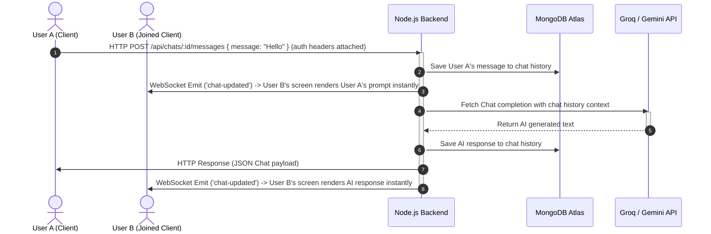

# SyncGPT Technical Architecture & Analysis

This document provides a comprehensive overview of the **SyncGPT** real-time collaborative ChatGPT clone architecture, file structures, and data flows to analyze how the project functions.

---

## 📂 Project Directory Structure

```text
chatgpt/
│
├── package.json                   # Root package manager (Vite + Node builds)
├── .gitignore                     # Git ignore rules for passwords and tokens
│
├── backend/                       # Node.js + Express API server
│   ├── .env                       # Local secrets (MongoDB URI, Groq/Gemini API keys)
│   ├── package.json               # Backend dependencies (express, mongoose, socket.io, groq-sdk)
│   ├── server.js                  # Entry point, HTTP server, and Socket.io setups
│   │
│   ├── middleware/
│   │   └── authMiddleware.js      # JWT authentication verification middleware
│   │
│   ├── models/
│   │   ├── User.js                # MongoDB User schema (credentials)
│   │   └── Chat.js                # MongoDB Chat schema (messages, share codes, participants)
│   │
│   ├── routes/
│   │   ├── authRoutes.js          # Authentication router (/api/auth)
│   │   └── chatRoutes.js          # Protected chat router (/api/chats)
│   │
│   └── controllers/
│       ├── authController.js      # Password hashing, JWT token issuer logic
│       └── chatController.js      # AI prompt handlers, Socket.io emitters, Mongoose DB queries
│
└── frontend/                      # React SPA
    ├── package.json               # Frontend dependencies (react-icons, axios, socket.io-client)
    ├── vite.config.js             # Vite building configurations
    ├── index.html                 # DOM entry point
    │
    └── src/
        ├── main.jsx               # React virtual DOM mounter
        ├── App.jsx                # Main controller React component (state, socket events, routing)
        ├── index.css              # Global styles (Dark Mode, layout, custom scrollbars, modal animations)
        │
        ├── components/
        │   ├── Auth.jsx           # Register & Login toggling interface
        │   ├── Sidebar.jsx        # Navigation sidebar (private list, shared join modal, logout button)
        │   ├── ChatWindow.jsx     # Messages rendering bubbles, system indicators, typing animations
        │   └── MessageInput.jsx   # Input console with auto-resizing text-field
        │
        └── services/
            ├── api.js             # Axios Client configured with JWT automatic interceptor
            └── socket.js          # Socket.io Client connector instance
```

---

## 🔄 End-to-End Data Flow

The following sequence illustrates the flow of a message sent from the React UI:



---

## 🛠️ Deep Dive: Code Components

### 1. Database Layer (MongoDB & Mongoose)
- **`User.js`**: Stores unique credentials. Passwords are encrypted before storing using **bcryptjs** (one-way salt hashing).
- **`Chat.js`**: Contains:
  - `creator` (ObjectID): Links to the user who started the room.
  - `participants` (Array of ObjectIDs): Lists all users who have access. If `User B` joins via a Share Code, their userID is added here, permanently saving this room in their sidebar.
  - `shareCode` (String): Indexed short uppercase room identifier (e.g., `X7K2M9`).

### 2. Authentication Protocol (JWT)
- **Token Generation**: On successful login/register, the backend signs a JWT with user details (`id`, `username`) and an expiration limit of 7 days.
- **Axios Interceptor (`api.js`)**: 
  An automatic request interceptor is configured on the frontend:
  ```javascript
  axios.interceptors.request.use((config) => {
    const token = localStorage.getItem('token');
    if (token) config.headers['Authorization'] = `Bearer ${token}`;
    return config;
  });
  ```
- **Auth Middleware (`authMiddleware.js`)**: Runs on all `/api/chats` routes, rejecting queries that do not contain a valid header signature.

### 3. Real-Time Sync (Socket.io)
- When a user joins or selects a chat, the client emits `join-room` with the room's `shareCode`:
  ```javascript
  // backend/server.js
  socket.on('join-room', ({ shareCode, username }) => {
    socket.join(shareCode);
    if (username) socket.to(shareCode).emit('user-joined', username);
  });
  ```
- Any edits/messages processed by the controller trigger a WebSocket broadcast:
  ```javascript
  // backend/controllers/chatController.js
  req.io.to(chat.shareCode).emit('chat-updated', chat);
  ```
- Connected clients instantly listen and update React state to re-render:
  ```javascript
  // frontend/src/App.jsx
  socket.on('chat-updated', (updatedChat) => {
    setMessages(updatedChat.messages);
  });
  ```
